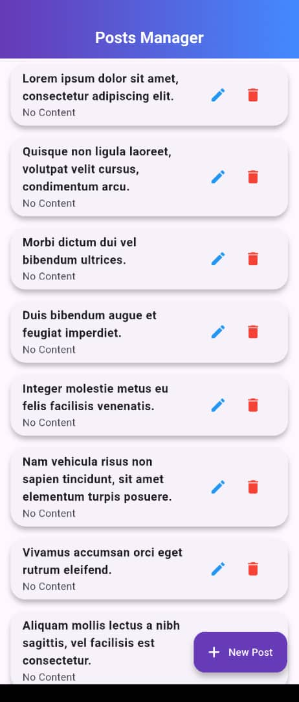
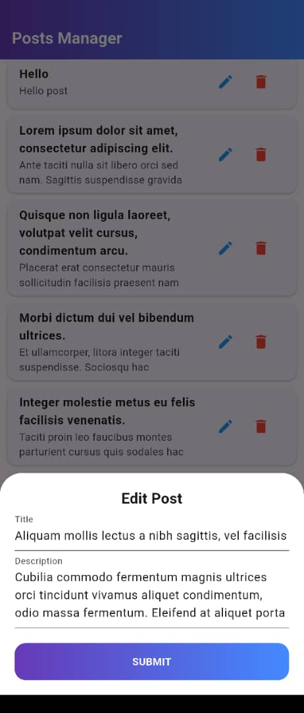
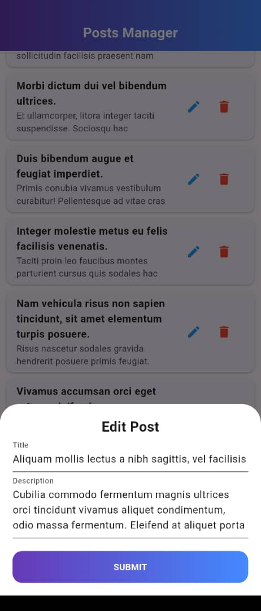
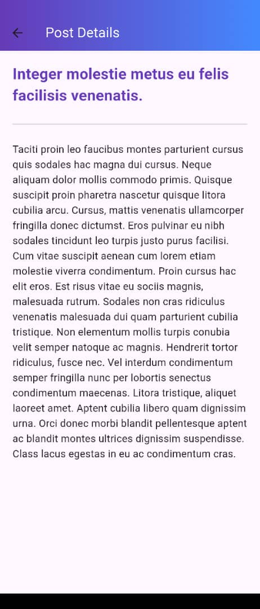

#  Posts Manager - Flutter API Lab

A professional-grade mobile application built for **Individual Flutter Lab 4: Consuming APIs in Flutter**. This application allows staff members to manage posts via a RESTful API, featuring full CRUD (Create, Read, Update, Delete) functionality with a modern, responsive UI.

## Features
- **View All Posts:** Fetch and display posts dynamically from the JSONPlaceholder API.
- **Post Details:** Read the full content of any post via a dedicated Detail screen.
- **Create Post:** Add new content using a custom, modern modal bottom sheet.
- **Update Post:** Modify existing post titles and bodies with real-time feedback.
- **Delete Post:** Remove posts from the system with immediate UI updates.
- **Optimistic UI:** Instant feedback loop for user actions.
- **Dynamic Feedback:** Context-aware `SnackBar` messages for success/error states.

## Technical Stack
- **Framework:** Flutter
- **Language:** Dart
- **Networking:** `http` package for RESTful operations
- **State Management:** `setState` with `Future` logic for reactive UI updates
- **Design:** Modern Material 3 UI with Gradient aesthetics and custom responsive modals.

## Project Structure
- `lib/main.dart`: Main entry point and core UI logic.
- `lib/api_service.dart`: API layer handling all CRUD network requests.
- `lib/post_model.dart`: Data model class mapping JSON to Dart objects.
- `lib/post_detail.dart`: Dedicated screen for viewing specific post details.

##  Implementation Details
### Handling API Exceptions
The application implements robust error handling using `try-catch` blocks and network timeouts. All API interactions are wrapped to prevent crashes, and network status is handled gracefully to ensure the app remains responsive during demo sessions.

### The Future Widget
The UI utilizes `Future` objects to manage asynchronous data fetching. A boolean `isLoading` state is toggled based on the resolution of the `fetchPosts()` future, ensuring a clean `CircularProgressIndicator` experience while data is being retrieved.

## Screenshots
| Main Dashboard | Add Form| Edit Form | Detail View |
| :---: | :---: | :---: | :---: |
| ** | ** | ** | ** |

## Submission Info
- **Name:** Aline NIYONIZERA
- **Lab Course:** Mobile Application Development
---
